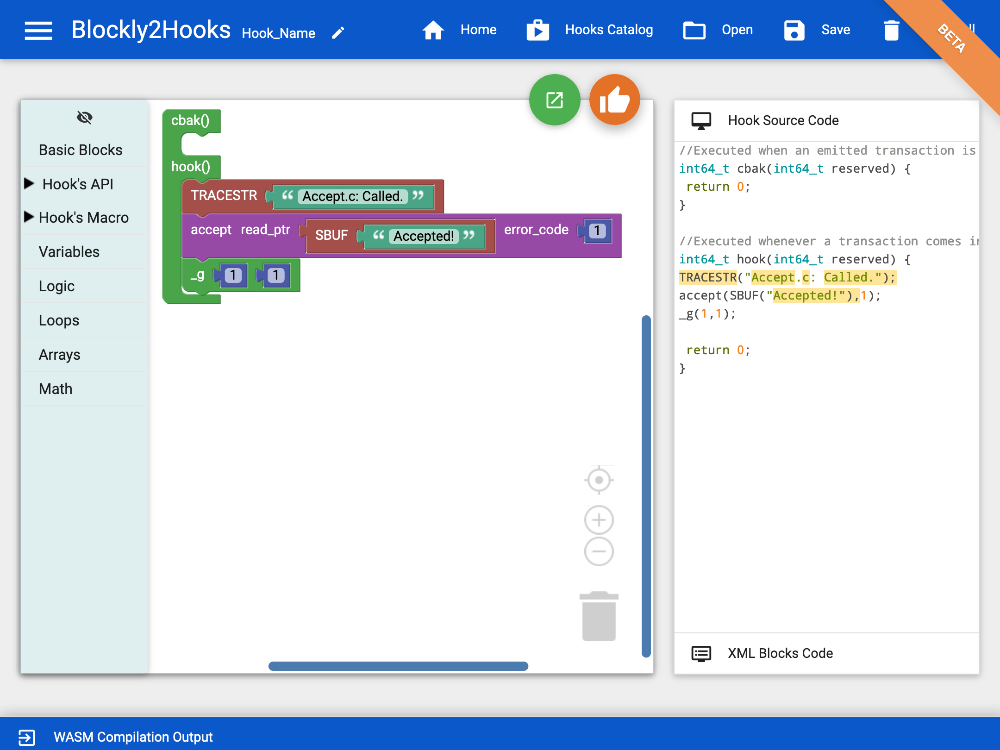

# Blockly2Hooks (Beta version)
 A platform for developing visually XRPL hooks smart contract using Blockly. We have integrated many features such as generating XRPL Hook code with visual drag-and-drop blocks, compile the genrate c code in to WASM form. Also, we have inegrated the deploymnet function so user can deploy the complied Hook to XRPL Hook testnet network.
 
 We build our the hooks block based on the offical documentation of the XRPL Hook [https://xrpl-hooks.readme.io/](https://xrpl-hooks.readme.io/)

### Getting Started 

Clone the Blockly2hook respresitory 

```bash
git clone https://github.com/wshbair/blockly2hooks
```

Run the server
```bash
npm start
```
Note: no need to install the moudles, since it has been already inegrated. 

Open the browser using [http://localhost:3000/](http://localhost:3000/)



### XRPL Hooks Examples
The plaftom has been integrated with some hooks for testing. More example can be found on [https://github.com/XRPL-Labs/xrpld-hooks/tree/hooks-ssvm/hook-api-examples](https://github.com/XRPL-Labs/xrpld-hooks/tree/hooks-ssvm/hook-api-examples)

### Credits
This project has been inspired and built using by [Ardublockly][1], we have modified, extend and adapt it to fit the XRPL Hooks development. 

### Funds
This project has been funded by the XRPL grant program 2021 [https://xrplgrants.org/grantees](https://xrplgrants.org/grantees)


[1]: https://github.com/carlosperate/ardublockly
 
