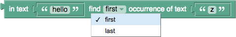
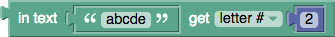
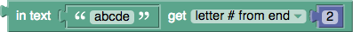
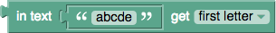
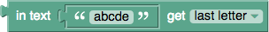
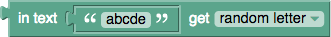
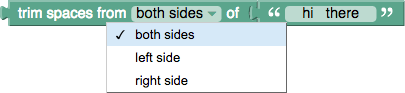
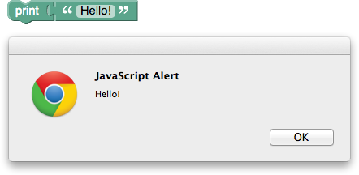
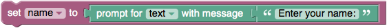
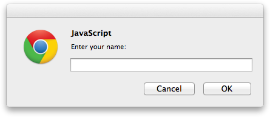

Examples of pieces of text are:
  * "thing #1"
  * "March 12, 2010"
  * "" (the empty text)
Text can contain letters (which may be lower-case or upper-case), numbers, punctuation marks, other symbols, and blank spaces between words.  (The non-Blockly term for all of these different types of text is [character](https://en.wikipedia.org/wiki/Character_(computing)).)

# Blocks

## Text creation
The following block creates the piece of text "hello" and stores it in the variable named ` greeting `.

The **create text with** block combines (concatenates) the value of the ` greeting ` variable and the new text "world" to create the text "helloworld".  Note that there is no space between them, since none was in either original text.

To increase the number of text inputs, click on the gear icon, which changes the view to:

Additional inputs are added by dragging an "item" block from the gray toolbox on the left into the "join" block.

## Text modification

The **to...append text** block adds the given text to the specified variable.  In this case, it changes the value of the variable ` greeting ` from "hello" to "hello, there!"

## Text length

The **length of** blocks count the number of letters, numbers, etc., in each text.  The length of "We're #1!" is 9, and the length of the empty text is 0.

## Checking for empty text
The **is empty** block checks whether the given text is empty (has length 0).  The result is **true** in the first case and **false** in the second.

## Finding text

These blocks can be used to check whether a piece of text is in another piece of text and, if so, where it appears.  For example, this asks for the first occurrence of "e" in "hello".  The result is 2.

This asks for the _last_ occurrence of "e" in "hello", which, is also 2.

Whether **first** or **last** is selected, this block will give the result 0, since "hello" does not contain "z".

## Extracting text

### Extracting a single character

This gets "b", the second letter in "abcde":

This gets "d", the second _to last_ letter in "abcde":

This gets "a", the first letter in "abcde":

This gets "e", the last letter in "abcde":

This gets any of the 5 letters in "abcde" with equal probability:

None of these modify the text on which the extraction is performed.

### Extracting a region of text

The **in text...get substring** block allows a region of text to be extracted, starting with either:
  * letter #
  * letter # from end
  * the first letter

and ending with:
  * letter #
  * letter # from end
  * the last letter

In the following example, "abc" is extracted.

## Adjusting text case

This block creates a version of the input text that is either:
  * UPPER CASE (all letters upper-case)
  * lower case
  * Title Case (first letters upper-case, other letters lower-case)

The result of the following block is "HELLO".

Non-alphabetic characters are not affected.  Note that this block on text in languages without case, such as Chinese.

## Trimming (removing) spaces

The following block removes space characters from:
  * the beginning of the text
  * the end of the text
  * both sides of the text

The result of the following block is "hi &nbsp; there".  (Spaces in the middle of the text are not affected.)

## Printing text

The **print** block causes the input value to be displayed in a pop-up window, as shown:

If the code is exported as JavaScript, Python, or Dart, it will be printed to the console (screen).  In no case is it sent to the printer, as the name might suggest.

## Getting input from the user

The following block creates a pop-up window that prompts the user to enter a name.  The result is stored in the variable **name**:

This is what the current version of the pop-up window looks like:

There is also a version of the block for getting a number from the user:

_This document has been based on the Blockly documentation under the same title by Neil Fraser released under [CC BY 3.0](https://creativecommons.org/licenses/by/3.0/)_
