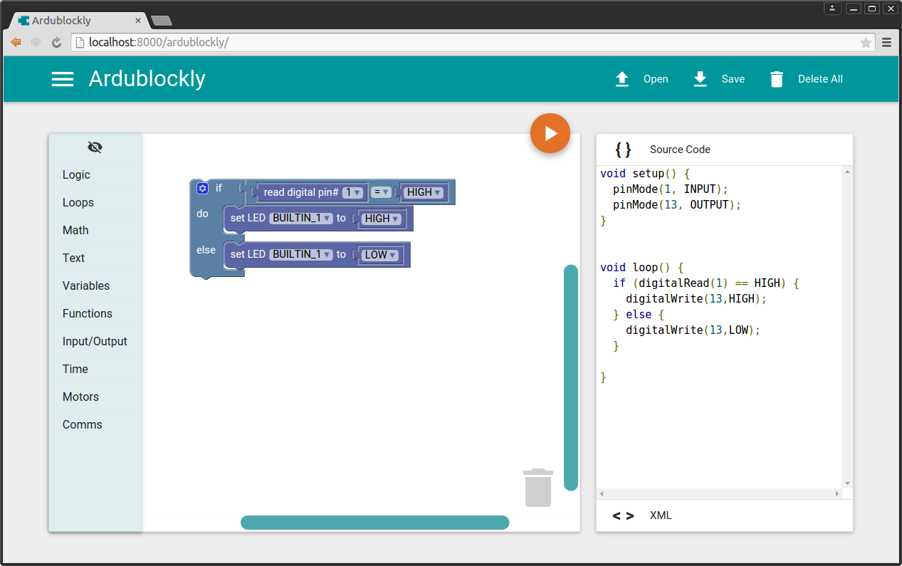

# Install Ardublockly

In order to simplify its use and to make it available to restricted systems, Ardublockly does not need to be installed, just downloaded and executed.

Ardublockly needs the Arduino IDE to be available as well, which can be downloaded from the [arduino.cc downloads page][1]. More information can be found in the [Configure Ardublockly document][15].

There are two ways to run Ardublockly:

a) __Executable application__: Simplest method, download a zip file which contains the pre-packaged Ardublockly executable desktop software.

b) __Core version__: Running directly from source code, requires only Python and a modern browser (like Chrome or Firefox).

Both these methods can be run from the "pre-packaged" downloads, and the GitHub repository source code.


## Download executable Ardublockly
The easiest way to use Ardublockly is to download the packaged version, which is a self-contained application that does not have any other dependencies (other than the Arduino IDE).

| Download the latest stable version from the [GitHub releases][2] page. |
|------------------------------------------------------------------------|

---

Or alternatively, but not recommended, you can download the latest development builds from the links below. These 
are automatically generated every time code is pushed to the repository and might contain unfinished or buggy features.

http://ardublockly-builds.s3-website-us-west-2.amazonaws.com/index.html

| Linux (64 bit only)           | Windows 7 or higher (32/64 bits) | macOS 10.8 or higher        |
|:-----------------------------:|:--------------------------------:|:---------------------------:|
| [![Linux Build Status][3]][4] | [![Windows Build status][5]][6]  | [![Mac Build Status][7]][8] |
| [Download Link][9]            | [Download Link][10]              | [Download Link][11]         |

For any of these and other platforms, the "core version" should work on all operating systems with Python and a modern web browser. 


## Run the executable Ardublockly
To run the application the steps are slightly different depending on the platform.

* __Windows__: Double click on the `ardublockly_run.bat` file located on the Ardublockly folder.
* __Linux__: Execute the `ardublockly_run.sh` shell script located on the Ardublockly folder.
* __OS X__: Right click the `Ardublockly.app` file and click `open`.

![Ardublockly desktop application][12]

The Arduino IDE is required to compile and load the programs into an Arduino board, more information can be found in the [Configure Ardublockly page][13].


## Download Ardublockly source code
The easiest way to download a full copy of the repository is using git:

```
git clone https://github.com/carlosperate/ardublockly.git
cd ardublockly
git submodule update --init --recursive
```

When the repository is downloaded [directly from github as zip file][14], the internal git submodules are not included, which is why git is the best method to download a working copy.

If you have already "git cloned" the Ardublockly source code, make sure the submodules are initialised. You can run the last git command above in the project root directory to ensure this is the case.

##### Download without git
If for some reason you are unable to use git, you can download [Ardublockly from GitHub as zip file](https://github.com/carlosperate/ardublockly/zipball/master) and the [Closure library as a zip file](https://github.com/google/closure-library/archive/master.zip). Uncompress the contents from the Ardublockly zip file and then unzip the Closure library into the `closure-library` folder within Ardublockly (make sure there is not an additional "closure-library" nested folder inside this one).

If you also need to build Ardublockly locally (which is not necessary to run the development version), all the git submodules required are listed in the [.gitmodules file in the repository](https://github.com/carlosperate/ardublockly/blob/master/.gitmodules).


## Run "core version" of Ardublockly 
This version is the main development environment for the application. You can easily run the latest updates using this method, and should be able to work if there is an issue running the packed Ardublockly application in your platform.

### Required Software
* [Python 3](https://www.python.org/download): Ardublockly maintains compatibility with Python 2 and 3 (tested on 2.7 and 3.4)
* [Arduino IDE version 1.6 or higher](http://arduino.cc/en/main/software): The latest version is always recommended
* Modern browser of your choice: Currently supports Firefox, Chrome, IE10+, Opera and Safari; Chrome is recommended
* Ardublockly source code: The "Downloading Ardublockly" section details how to obtain it

#### Linux only requirement
Tkinter, which is used in Ardublockly, is not always part of standard Python environment on Linux and needs to be installed.

Install Tkinter for Python 2 on Ubuntu:

```
sudo apt-get install python-tk
```

OR, install Tkinter for Python 3 on Ubuntu:

```
sudo apt-get install python3-tk
```

### Run Ardublockly from source code
To run the "core version" execute the `start.py` python script file located on the the root of the Ardublockly folder (this also works on the "packaged" executable Ardublockly version):

```
python start.py
```

Your default browser should open a local web page to load the Ardublockly application.



## Run the full Ardublockly desktop application from source
To run the full desktop version of the development Ardublockly you will also need to install [node.js](https://nodejs.org/).

Navigate to the `electron` folder inside the `package` directory:

```
cd package\electron
```

Execute the following command to download all the dependencies required to for the desktop application, this might take a while:

```
npm install
```

Once that's done, run the following command to open the desktop application:

```
npm start
```

The Arduino IDE is still required to compile and load the programs into an Arduino board, more information can be found in the [Configure Ardublockly page](https://github.com/carlosperate/ardublockly/wiki/Configure-Ardublockly).

[1]: https://www.arduino.cc/en/Main/Software
[2]: https://github.com/carlosperate/ardublockly/releases
[3]: https://circleci.com/gh/carlosperate/ardublockly/tree/master.svg?style=svg
[4]: https://circleci.com/gh/carlosperate/ardublockly/tree/master
[5]: https://ci.appveyor.com/api/projects/status/t877g920hdiifc2i?svg=true
[6]: https://ci.appveyor.com/project/carlosperate/ardublockly
[7]: https://travis-ci.org/carlosperate/ardublockly.svg?branch=master
[8]: https://travis-ci.org/carlosperate/ardublockly
[9]: http://ardublockly-builds.s3-website-us-west-2.amazonaws.com/index.html?prefix=linux/
[10]: http://ardublockly-builds.s3-website-us-west-2.amazonaws.com/index.html?prefix=windows/
[11]: http://ardublockly-builds.s3-website-us-west-2.amazonaws.com/index.html?prefix=mac/
[12]: img/screenshots_cross_platform_1.png
[13]: https://github.com/carlosperate/ardublockly/wiki/Configure-Ardublockly
[14]: https://github.com/carlosperate/ardublockly/zipball/master
[15]: Configure-Ardublockly